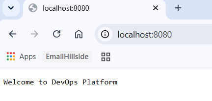
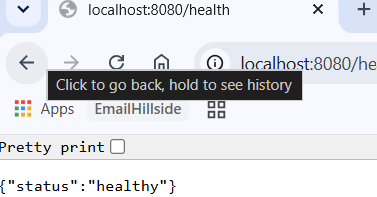
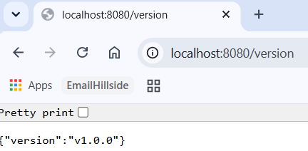
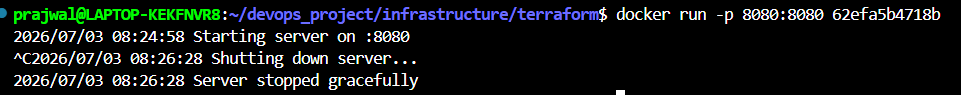
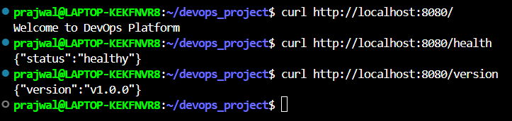

# Building a Production-Ready Go Web Service -- Project 1 (Part 1)

> **Series:** DevOps Project Series\
> **Part:** 1 of 3

## Introduction

As part of my journey toward becoming a DevOps Engineer, I wanted to
move beyond tutorials and build projects that reflect real engineering
practices. Rather than deploying a simple "Hello World" application, I
decided to create a small Go web service that could eventually be
containerized and deployed to the cloud using Infrastructure as Code.

This project is the first part of a larger DevOps series where I will
gradually build a complete deployment pipeline using Docker, Terraform,
and Microsoft Azure.

The goal of this article is to explain how I designed and built the
application itself before worrying about containers or cloud
infrastructure.

## Why Go?

I chose Go for several reasons.

First, Go has become one of the most popular programming languages in
cloud-native computing. Many modern DevOps tools including Docker,
Kubernetes, Prometheus, and Terraform are written in Go. Learning the
language helps me understand not only application development but also
the tools used throughout the DevOps ecosystem.

Second, Go produces a single statically compiled binary. This makes
deployment extremely simple because there are no runtime dependencies to
install on the target machine.

Finally, Go provides excellent concurrency support and a lightweight
standard library that is sufficient for building production-ready HTTP
services without requiring large external frameworks.

## Project Goals

Before writing any code, I defined a few realistic goals for the
application.

Instead of focusing on features, I focused on operational
characteristics that are important in production.

The application should:

- expose an HTTP server
- provide a health endpoint
- expose application version information
- support environment variables
- shut down gracefully
- be easy to containerize
- be suitable for cloud deployment

Although the application itself is intentionally simple, these
characteristics mirror what many production microservices provide.

## Designing the Project Structure

Rather than placing everything inside a single file, I organized the
project into separate packages.

The directory structure looks like this:

    app/
    ├── cmd/
    │   └── server/
    ├── internal/
    │   ├── config/
    │   └── handlers/
    ├── Dockerfile
    ├── go.mod
    └── Makefile

This layout separates application startup logic from business logic and
configuration.

Keeping responsibilities separated makes the project easier to maintain
as it grows.

## 

## Building the HTTP Server

The application exposes three endpoints.

### Home Endpoint

The root endpoint simply confirms that the application is running.

    GET /

This endpoint is useful for quickly verifying that the application is
accessible.

### Health Endpoint

    GET /health

Health endpoints are commonly used by load balancers, container
orchestrators, and monitoring systems to determine whether an
application is healthy.

Although my current implementation simply returns a successful response,
this endpoint could later include database connectivity checks or
external service health.

### Version Endpoint

    GET /version

The version endpoint exposes the running application version.

In production environments, knowing exactly which version is deployed
helps with debugging, rollbacks, and deployment verification.

Later in this project series, I plan to extend this endpoint to include
Git commit hashes and build timestamps.

{width="3.600311679790026in"
height="1.7251498250218722in"}

{width="3.141938976377953in"
height="1.6418088363954506in"}

{width="3.600311679790026in"
height="1.766819772528434in"}

## Configuration Using Environment Variables

Instead of hardcoding configuration values, I used environment variables
wherever possible.

This follows the principles described in the Twelve-Factor App
methodology.

Separating configuration from code makes it possible to run the same
application binary across development, testing, and production
environments simply by changing environment variables.

This becomes especially important once the application is deployed
inside containers.

## Implementing Graceful Shutdown

One feature I specifically wanted to implement was graceful shutdown.

When an application receives an interrupt signal, it should not
terminate immediately.

Instead, it should:

- stop accepting new requests
- finish processing existing requests
- release resources
- exit cleanly

Go's standard HTTP server provides built-in support for graceful
shutdown, making this relatively straightforward to implement.

Testing this locally showed the server shutting down without abruptly
terminating active connections.

> {width="6.5in" height="0.6423611111111112in"}

## Testing the Application

Before thinking about Docker or cloud deployment, I verified that
everything worked locally.

I tested every endpoint using both a browser and `curl`.

    curl http://localhost:8080/
    curl http://localhost:8080/health
    curl http://localhost:8080/version

Verifying the application locally first made debugging significantly
easier before introducing additional layers like containers or cloud
infrastructure.

{width="6.025521653543307in"
height="1.4334580052493437in"}

## Lessons Learned

Although this application is intentionally small, I learned several
important engineering concepts while building it.

The biggest lesson was that production readiness is not determined by
the number of features an application provides.

Instead, operational concerns such as health checks, configuration
management, graceful shutdown, and maintainable project organization
play an equally important role.

I also gained a better appreciation for Go's simplicity. The standard
library provides everything necessary to build a robust HTTP service
without relying heavily on external dependencies.

Finally, designing the application with deployment in mind from the
beginning made the later Docker and Terraform phases much easier.

## What's Next?

With the application complete, the next step is to package it inside a
Docker container.

In the next article, I will explain how I used a multi-stage Docker
build to create a small production-ready image and prepare the
application for cloud deployment.

## Repository

GitHub Repository:

https://github.com/khatri11-cloud/devops_project

## References

- Go Documentation
- Docker Documentation
- Microsoft Azure Documentation

Thank you for reading.

If you have suggestions or feedback, feel free to connect with me on
LinkedIn. This project is part of my public learning journey toward
becoming a DevOps Engineer, and I'll continue documenting each stage as
I build more complex cloud-native projects.
