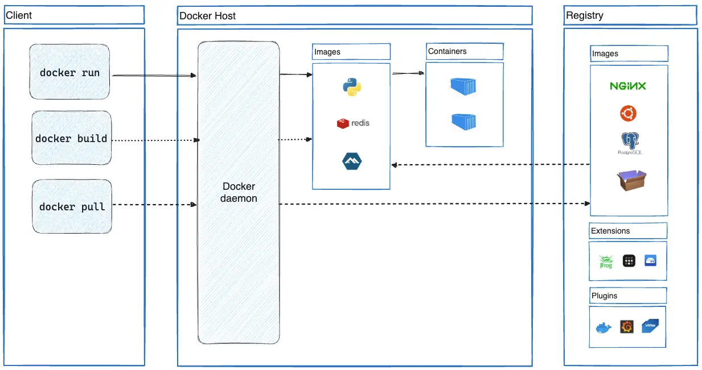
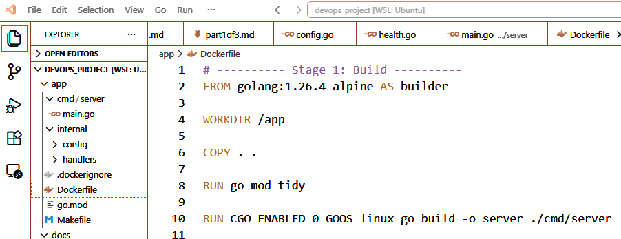
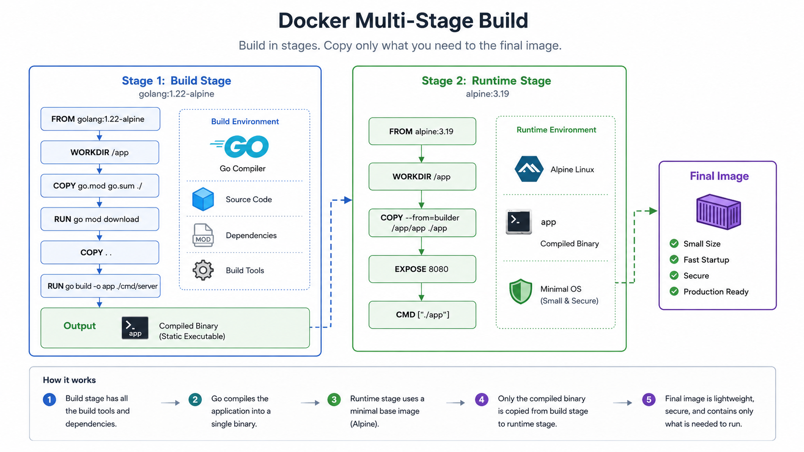
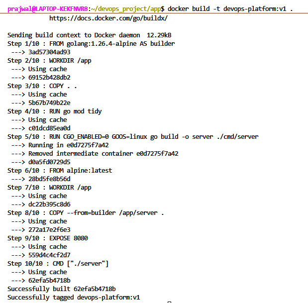
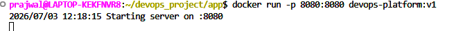
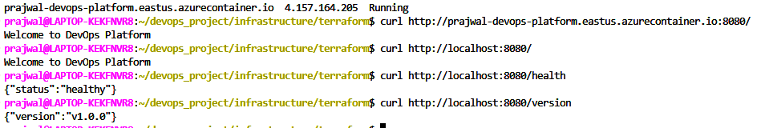

+++
title = "Containerizing a Go Application with Docker -- Project 1 (Part 2)"
tags = ["DevOps", "Go"]
date = "2026-07-05"
+++

# Containerizing a Go Application with Docker -- Project 1 (Part 2)

**Series:** DevOps Project Series\
**Part:** 2 of 3

## Introduction

In the first part of this series, I built a production-ready Go web
service with health checks, version information, configuration through
environment variables, and graceful shutdown.\
\
The application worked perfectly on my development machine, but there
was still a major problem.\
\
Running software directly on a local machine does not guarantee that it
will behave the same way on another developer\'s computer, inside a
virtual machine, or in the cloud. Differences in operating systems,
installed libraries, and runtime environments often lead to the
well-known phrase: "It works on my machine."\
\
To solve this problem, I containerized the application using Docker. The
goal was not simply to package the application but to create a
lightweight, portable, and production-ready container that could later
be deployed to Microsoft Azure.\
{width="5.708333333333333in"
height="3.013888888888889in"}

Docker architecture

https://docs.docker.com/get-started/docker-overview/

## Why Containers?

A container packages the application, runtime dependencies, libraries,
and configuration into a single immutable artifact.\
\
Instead of documenting how another developer should install Go and
configure the environment manually, Docker allows the runtime
environment to travel with the application itself. This ensures
consistency across development, testing, and production.

## Building the Dockerfile

I wanted to avoid creating unnecessarily large Docker images. Since Go
produces a statically compiled binary, I used a multi-stage Docker
build.\
\
The first stage compiles the application. The second stage contains only
the compiled executable, significantly reducing image size and improving
security.\
{width="6.0in" height="2.308333333333333in"}

## Understanding Multi-Stage Builds

Source Code\
↓\
Builder Image (Go SDK)\
↓\
Compile Binary\
↓\
Runtime Image (Alpine Linux)\
↓\
Small Production Image\
\
Initially I assumed Docker simply copied my application into an image.
Learning about multi-stage builds showed me how build tools can be
excluded from the final runtime image, producing a cleaner and more
secure deployment.\
{width="5.991666666666666in" height="3.375in"}

## Building the Image

Command:\
\
docker build -t devops-platform:v1 .\
\
Docker executed each instruction in the Dockerfile and produced a
reusable image. I also noticed Docker\'s layer caching, which made
repeated builds significantly faster when only the application code
changed.\
{width="5.158780621172354in"
height="5.0754396325459314in"}

## Running the Container

Command:\
\
docker run -d -p 8080:8080 devops-platform:v1\
\
Port mapping exposed the application on localhost while it continued
running in an isolated container.\
\
{width="5.433804680664917in"
height="0.37503280839895015in"}

## Verifying the Application

I tested the application using:\
\
curl http://localhost:8080/\
curl http://localhost:8080/health\
curl http://localhost:8080/version\
\
The responses matched the locally executed application exactly.\
\
{width="6.0in" height="1.0166666666666666in"}

## Challenges I Encountered

Like most projects, everything did not work perfectly on the first
attempt.\
\
One issue I encountered involved the Go version specified in my go.mod
file. My local installation was newer than the version used inside the
Docker image, causing the build to fail.\
\
Updating the Docker base image to match my local Go version resolved the
issue. This was a valuable reminder that containerized environments
should closely match the development environment to avoid compatibility
problems.\
\
I also gained a better understanding of Docker image tags and why
versioning images is important for upgrades and rollbacks.

## Lessons Learned

Containerizing the application taught me that Docker is much more than a
packaging tool. It provides consistency, portability, and
reproducibility---qualities that are essential in modern software
engineering.\
\
One lesson I hope to carry into future projects is that documenting
mistakes is just as valuable as documenting successes. The debugging
process often teaches more than a perfectly smooth implementation, and
including those experiences makes the engineering journey more authentic
for readers.

## What\'s Next?

With a portable Docker image running locally, the next challenge is
cloud deployment.\
\
In Part 3, I will provision Microsoft Azure infrastructure using
Terraform, publish the Docker image to Azure Container Registry, and
deploy the application to Azure Container Instances.
