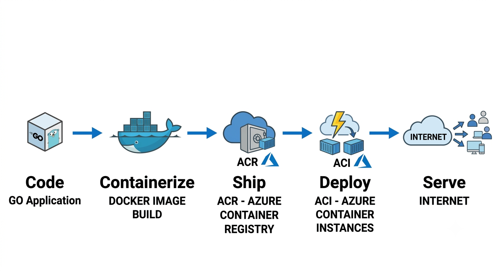
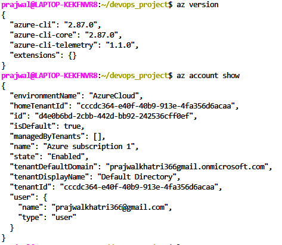
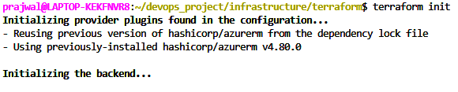
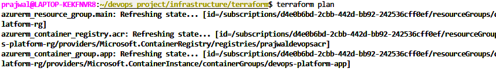
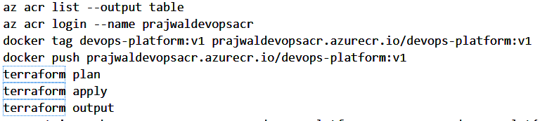
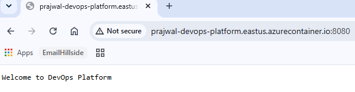

+++
title = "Provisioning Azure Infrastructure with Terraform and Deploying a Go Application -- Project 1 (Part 3)"
tags = ["DevOps", "Go"]
date = "2026-07-05"
+++

# Provisioning Azure Infrastructure with Terraform and Deploying a Go Application -- Project 1 (Part 3)

Series: DevOps Project Series\
Part: 3 of 3

## Introduction

At the end of Part 2, my Go application was running perfectly inside a
Docker container. The problem was that it still lived on my laptop. The
final step was taking it from localhost to the cloud using Terraform and
Microsoft Azure.

## Why Azure?

Although I hold the AWS Solutions Architect -- Associate (SAA-C03)
certification, I chose Azure for this project for a practical reason. I
had already used the AWS credits available to me, so Azure became the
platform where I could continue learning without interruption. More
importantly, I wanted to focus on cloud concepts that transfer across
providers: containers, registries, Infrastructure as Code, and
deployments.\
\
{width="6.0in" height="3.275in"}

## Planning the Deployment

Before writing Terraform, I mapped a simple workflow: Go application →
Docker image → Azure Container Registry → Azure Container Instance →
Public Internet. Breaking the project into stages made it easier to
understand each component\'s responsibility.

## Preparing Azure

I installed the Azure CLI, authenticated with my account, and confirmed
the correct subscription before running Terraform. Did login to azure
using az login.

{width="3.942007874015748in"
height="3.4252963692038496in"}

## Infrastructure as Code

Instead of creating resources manually, I defined a Resource Group,
Azure Container Registry, and Azure Container Instance in Terraform.
This meant the infrastructure could be recreated consistently from code.

## A Small Surprise

During my first Terraform run, provider registration took much longer
than expected. I interrupted it, assuming it had frozen. After reading
the output and trying again, I realized Terraform was performing a
normal initialization task. It reminded me that understanding the tools
is just as important as using them.

{width="4.8337521872265965in"
height="0.975084208223972in"}\
{width="6.0in"
height="0.9159722222222222in"}

## Publishing the Container

After creating Azure Container Registry, I tagged my Docker image and
pushed it to ACR. This helped me understand that Azure Container
Instances pull images from a registry rather than directly from my local
machine.\
\
{width="6.0in"
height="1.351388888888889in"}

## Deployment

Terraform provisioned the Azure Container Instance, pulled the image
from ACR, and assigned a public FQDN. Opening that URL and seeing my Go
application running outside localhost was the highlight of the project.\
{width="5.017101924759405in"
height="1.3084470691163606in"}

## Public Endpoint

prajwal-devops-platform.eastus.azurecontainer.io

## Lessons Learned

This project changed how I think about software delivery. Go built the
application, Docker packaged it, Azure Container Registry stored it,
Terraform created the infrastructure, and Azure Container Instances ran
it. The biggest lesson wasn\'t memorizing commands---it was
understanding how these technologies work together.

## What\'s Next?

The next step is to build on this foundation by introducing GitHub
Actions for CI/CD, monitoring with Prometheus and Grafana, and more
production-oriented DevOps practices.
